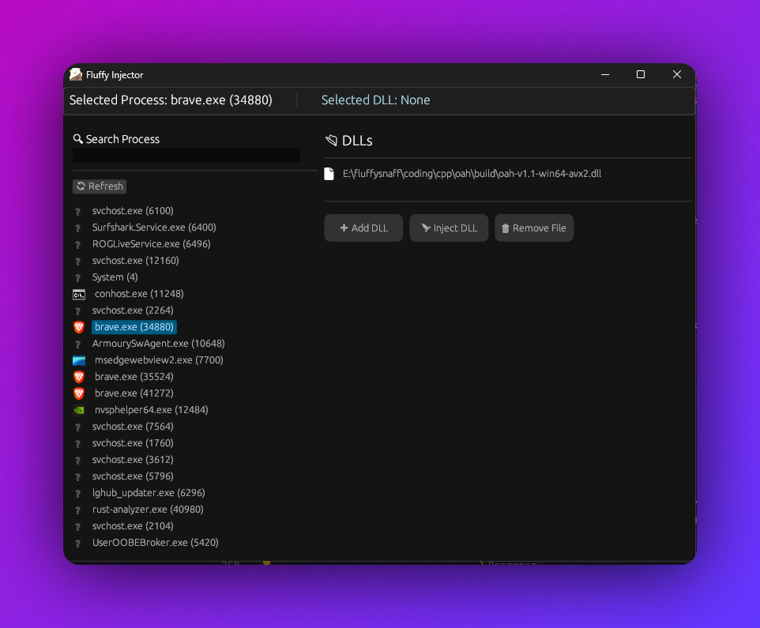

# 🦀 Fluffy Injector
Fluffy Injector is a **Rust-based DLL injector** with an **egui**-powered GUI, allowing easy injection of DLLs into running processes. The interface is user-friendly, and the injection process is seamless.

<p align="center">
  
</p>

## 🚀 Features
### 📂 Process & DLL Management:
- **List running processes** (Name & PID)
- **Search for processes**

### ⚡ Injection:
- **Inject a DLL into a selected process**
- **Uses `CreateRemoteThread` & `LoadLibraryA`**

### 🎨 User Interface:
- **Sleek dark mode UI**
- **Process & DLL panels with scrolling support**
- **Styled buttons & animated injection status**
- **Error handling for missing DLLs or processes**

## 🛠️ How to Use
Fluffy Injector is built using Rust and designed to run on **Windows**.

### ⚙️ Build Instructions
1. **Clone the Repository**:
   ```bash
   git clone https://github.com/fluffysnaff/fluffy-injector
   ```
2. **Install Rust & Dependencies**:
   - Install Rust using [rustup](https://rustup.rs/)
   - Ensure you have a Windows build environment
   - Install required dependencies with:
     ```bash
     cargo build
     ```
3. **Run the Injector**:
   ```bash
   cargo run --release
   ```

### 🏗️ Dependencies
Fluffy Injector uses:
- **egui + eframe** (GUI framework)
- **sysinfo** (Process listing)
- **windows** (Win32 API bindings)
- **rfd** (File dialogs for DLL selection)

## 🖥️ Screenshots


## 🤝 Contributions
Contributions are welcome! If you have improvements, bug fixes, or feature requests, feel free to submit a pull request.

### 🔄 Updating Instructions
1. Ensure you have Rust installed.
2. Pull the latest changes from the repo:
   ```bash
   git pull origin main
   ```
3. Rebuild the project:
   ```bash
   cargo build --release
   ```

## ⭐ Star the Repo!
If you find this project useful, **drop a star** on GitHub to support development!

[](https://star-history.com/#fluffysnaff/fluffy-injector&Date)